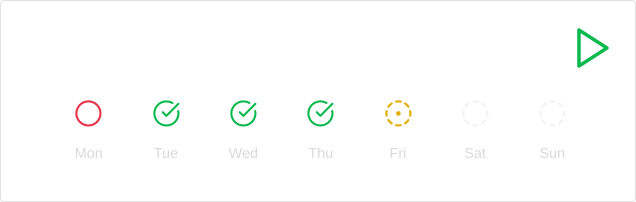

<p align="center">

</p>

<p align="center">

 
 

</p>

<p>
Spaced repetition using flashcards.<br/>
Currently, only manual input cards are supported.
</p>

## Card fields
```json5 
{
	id: "uniqueID",  // Card unique id, if empty create automatically, using question data;
	title: "title",  // Card title;
	question: {
		left: ['Question', ...],  // Left question options;
		right: ['Answer', ...]  // Right question options;
	},
	pool: "pool",  // Card pool;
	tags: ["tag1", "tag2", ...],  // Array of tags;
	defaultSide: "left",  // If card not reversible, then that side will be considered questions;
	notReversible: true  // If card reversible, then the questions and answers will switch places;
}
```

## Definition
### JSON
~~~
```quizjson
[
  {
	"question": {
		"left": ["question1", "subQuestion1"],
		"right": ["answer1", "answer2", "answer3"]
	},
	"pool": "testPool1",
	"tags": ["exampleTag1", "exampleTag2", "exampleTag3"],
	"notReversible": true
  }
]
```
~~~

### JS
Must be enabled from settings. <br/>
In the code `fc` object is available with two methods:
- `addCard(flashcard);` - Adds a card, if it is not valid performs an exception.
 - `commit();` - Must be called after all required cards have been added.

~~~
```quizjs

for(let i = 0; i < 100; i++) {
	fc.addCard({
		question: {
			left: [`question${i}`],
			right: [`answer${i}`]
		},
		pool: "testPool2",
		tags: [`exampleTag${i}`]
	});
}

fc.commit();
```
~~~

### <b>See more at [examples](examples/Example)</b>


## Running quiz
You can start a quiz either from the menu with an icon or a command `Simple Quiz:Run quiz!`, or by pressing the button on cards placeholder. <br/>
When you start a quiz from the menu or by command, all available cards will be loaded. <br/>
When launching from the placeholder, only cards declared in it will be loaded.


## Manually installing the plugin
Copy over `main.js`, `styles.css`, `manifest.json`, to `<vault>/.obsidian/plugins/simple-quiz/`


## TODO
- [ ] Add new card types
  - [ ] Manually cards
  - [ ] Matching cards
  - [ ] Option select cards
- [ ] Add images to cards
- [ ] Add statistics charts  
