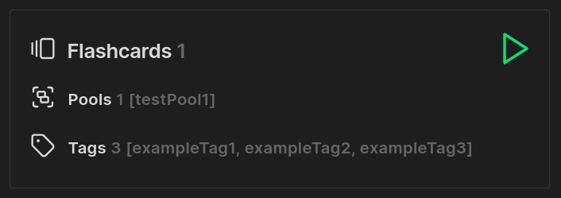
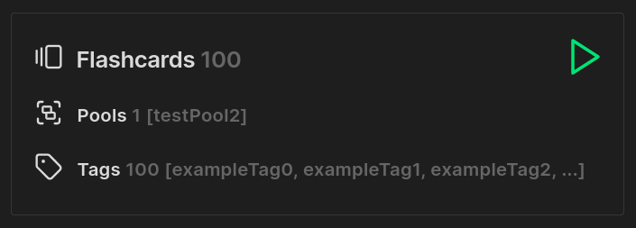
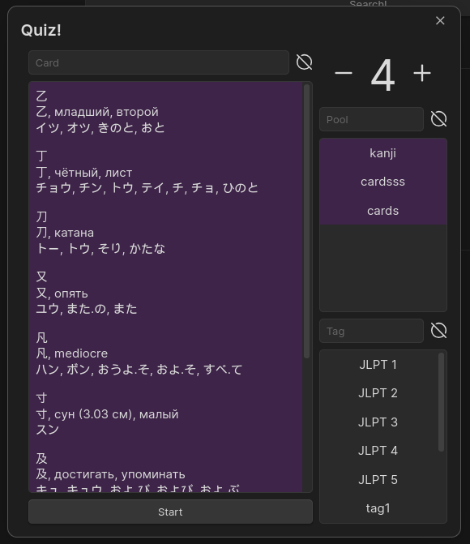

# Simple Quiz
     <br/><br/>
Quiz plugin for [Obsidian](https://obsidian.md). <br/>
Allows you to easily create sets of flashcards for repetition. <br/>
Currently only flashcards with manual input are supported.

## Example
### JSON
Defining a card using json
~~~
```quizjson
[
  {
	"question": {
		"left": ["question1", "subQuestion1"],
		"right": ["answer1", "answer2", "answer3"]
	},
	"pool": "testPool1",
	"tags": ["exampleTag1", "exampleTag2", "exampleTag3"],
	"notReversible": true
  }
]
```
~~~
Renders to
<p align="center">
	
</p>

### JS
Defining a card using js <br/>
Support using async/await <br/>
**Code must return an array of cards**
~~~
```quizjs
let flashcards = [];

for(let i = 0; i < 100; i++) {
	flashcards.push({
		question: {
			left: [`question${i}`],
			right: [`answer${i}`]
		},
		pool: "testPool2",
		tags: [`exampleTag${i}`]
	});
}

return flashcards;
```
~~~
Renders to
<p align="center">
	
</p>

### All cards fields
```json5
{
	id: "uniqueID",  // Card unique id, if empty create automatically;
	title: "title",  // Card title;
	question: {
		left: ['Question'],  // Left question options;
		right: ['Answer']  // Right question options;
	},
	pool: "pool",  // Card pool;
	tags: ["tag1", "tag2"],  // Array of tags;
	defaultSide: "left",  // If card not reversible, then that side will be considered questions;
	notReversible: true  // If card reversible, then the questions and answers will switch places;
}
```

### Running quiz
You can start a quiz for a set of cards from their placeholder. <br/>
Or, you can run a quiz for all cards from the side menu, or by command `Simple Quiz:Run quiz!`. </br>
In the menu that opens, you can select specific cards to repeat, or by pools or by tags. </br>
You can also specify how many cards out of the total number will be shown at a time. </br>
Cards are sorted by percentage of successful answers. </br>
<p align="center">
	
</p>

### Example project
[Example](example/example.md)


## TODO
- [ ] Add new card types
  - [ ] Manually cards
  - [ ] Matching cards
  - [ ] Option select cards
- [ ] Add images to cards
- [ ] Add statistics charts  

## Manually installing the plugin
- Copy over `main.js`, `styles.css`, `manifest.json`, to `<vault>/.obsidian/plugins/simple-quiz/`.
