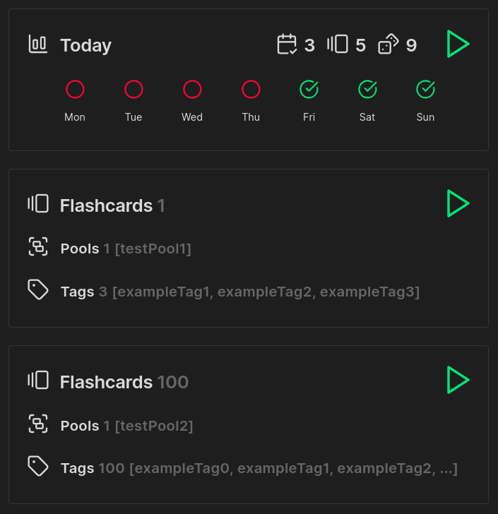

# Examples
Obsidian vault with examples of usage quizzes.  
Copy `snippets` to `<vault>/.obsidian/snippets`, and install plugin.  

## Preview.md
Contains example of usage blocks

	

## KanjiExample
Example using quiz for kanji repetition, in `Search.md`

